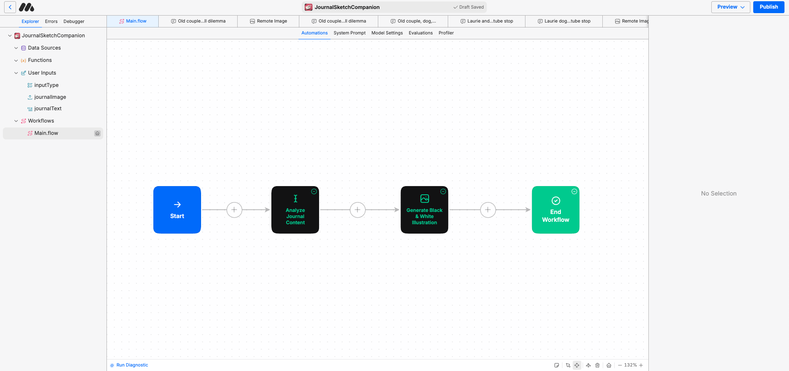

# NoteSelfSelf

An art installation that reimagines the iPhone Notes app as a canvas for collective human expression. Users submit their most personal thoughts anonymously, which are then transformed into minimalist line art through AI. The project explores the intersection of digital intimacy, anonymous expression, and algorithmic interpretation.

## 🌟 Features

- **Digital Intimacy**: Capturing the raw, unfiltered thoughts we typically keep in our iPhone Notes
- **Anonymous Expression**: Creating a safe space for sharing deeply personal reflections
- **AI Interpretation**: Transforming private thoughts into public art through algorithmic processing
- **Social Media Integration**: Bridging private expression with public sharing (coming soon)

## 🎨 AI Integration

### The iPhone Notes Connection
The project draws inspiration from the iPhone Notes app - a private space where we often store our most authentic thoughts. By inviting users to share these notes anonymously, we create a collective portrait of human experience.

1. User submits a note from their Notes app
2. Admin reviews and curates the content
3. MindStudio AI processes the text and generates unique artwork
4. Artwork is displayed in the public gallery

## 🏗️ Technical Architecture

### Frontend
- **Next.js 13+**: Server-side rendering and API routes
- **React Server Components**: Optimized performance
- **Tailwind CSS**: Styling and responsive design
- **Radix UI**: Accessible component primitives

### Backend
- **Next.js API Routes**: Serverless functions
- **Supabase**: Database and storage
- **MindStudio AI**: Art generation API
- **Content Management System**: Built-in curation tools

## 📸 Screenshots

### Home Page

### Submission Form

### Gallery

### Admin Dashboard

